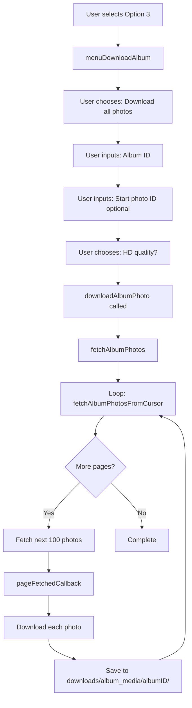
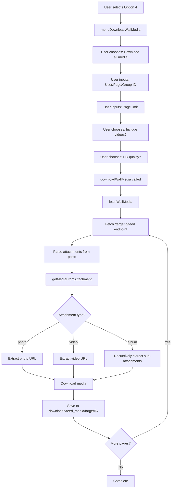

# FB Media Downloader - Project Overview

## 📋 Project Description

**FB Media Downloader** is a Node.js command-line tool that uses Facebook's Graph API to download photos and videos from Facebook. It provides an interactive menu interface to download media from various Facebook sources including albums, user timelines, and walls/feeds.

## 🎯 Main Features

The tool offers **9 main functions** accessible through an interactive menu:

### 1. **View Album Information** (`fetchAlbumInfo`)
- Query and display metadata about a Facebook album
- Shows: album ID, count of photos, link, and name
- Useful for verifying album details before downloading

### 2. **Find Timeline Album ID of Page** (`fetchTimeLineAlbumId_FBPage`)
- Locate the timeline album ID for a Facebook Page
- Timeline albums contain all photos posted directly to a page's wall
- Displays album information once found

### 3. **Download Album** (User/Page/Group)
- **Download all photos from an album**
  - Downloads actual image files in high quality
  - Option to get largest/HD resolution
  - Can resume from a specific photo ID
- **Download all photo links from an album**
  - Saves photo IDs and URLs to a text file
  - Faster than downloading actual files
  - Useful for later processing

### 4. **Download Wall Media** (User/Group/Page)
- **Download all media from a wall/feed**
  - Downloads photos and/or videos from posts
  - Supports pagination (can limit number of pages)
  - Option to include/exclude videos
  - Option for HD photo quality
- **Download all media links from wall**
  - Saves media IDs and URLs to text file
  - Includes both photos and videos

### 5. **Download All Photos/Videos of User** ⭐ NEW
- **Download all uploaded photos by a user**
  - Gets photos from all albums
  - Includes photo metadata (album name, description)
  - Supports pagination with cursor-based resuming
- **Download all uploaded videos by a user**
  - Downloads all videos uploaded by the user
  - Includes video metadata (length, quality, description)
  - HD quality when available

### 6. **Download from URL File** (Instagram) ⭐ NEW
- Import a text file containing media URLs (one per line)
- Automatically downloads all URLs from the file
- Supports both images (.jpg) and videos (.mp4)
- Originally designed for Instagram links but works with direct URLs

### 7. **Language Selection** (Tiếng Việt / English)
- Switch between Vietnamese and English interface
- Multilingual support using translation keys

### 8. **Help/Support**
- Display contact information for support

### 9. **Exit**
- Gracefully close the application

---

## 🏗️ Project Structure

```
FBMediaDownloader/
├── index.js                          # Entry point - launches menu
├── config.js                         # Configuration (ACCESS_TOKEN, settings)
├── package.json                      # Dependencies (node-fetch)
├── test_token.js                     # Token validation diagnostic tool
├── TROUBLESHOOTING.md                # Error resolution guide
├── PROJECT_OVERVIEW.md               # This file
│
├── downloads/                        # Output directory for all downloads
│   ├── album_media/                  # Album photos
│   ├── feed_media/                   # Wall/feed media
│   ├── user_photos/                  # User-uploaded photos
│   ├── user_videos/                  # User-uploaded videos
│   ├── links/                        # Text files with media URLs
│   └── from-file/                    # Downloads from URL files
│
└── scripts/                          # Core modules
    ├── menu.js                       # Interactive CLI menu system
    ├── constants.js                  # API host, media types, colors
    ├── utils.js                      # Utility functions (fetch, download, file ops)
    ├── lang.js                       # Internationalization (i18n)
    ├── logger.js                     # Logging functionality
    │
    ├── download_album.js             # Album download logic
    ├── download_timeline_album.js    # Page timeline album finder
    ├── download_wall_media.js        # Wall/feed download logic
    ├── download_user_photos.js       # User photos download
    ├── download_user_videos.js       # User videos download
    │
    └── bookmarks.js                  # Browser automation helpers
```

---

## 🔄 Code Flow & Architecture

### **High-Level Flow**

```
┌─────────────┐
│  index.js   │  Entry point
└──────┬──────┘
       │
       ▼
┌─────────────┐
│  menu.js    │  Display interactive menu
└──────┬──────┘
       │
       ├─────────────► Option 1: fetchAlbumInfo()
       ├─────────────► Option 2: fetchTimeLineAlbumId_FBPage()
       ├─────────────► Option 3: menuDownloadAlbum()
       ├─────────────► Option 4: menuDownloadWallMedia()
       ├─────────────► Option 5: menuDownloadPhotoVideoOfUser()
       ├─────────────► Option 6: menuDownloadFromFile()
       └─────────────► Option 7: menuSelectLanguage()
```

### **Detailed Flow Examples**

#### **Flow 1: Download Album Photos**



#### **Flow 2: Download Wall Media**



---

## 🧩 Core Modules Explained

### **1. menu.js** - User Interface
- **Purpose**: Provides interactive CLI menu using `readline`
- **Key Functions**:
  - `prompt()` - Async user input
  - `choose()` - Display menu and get selection
  - `menu()` - Main menu loop
  - `menuDownloadAlbum()` - Album download submenu
  - `menuDownloadWallMedia()` - Wall media submenu
  - `menuDownloadPhotoVideoOfUser()` - User media submenu
  - `menuDownloadFromFile()` - File import menu

### **2. download_album.js** - Album Operations
- **Purpose**: Fetch and download photos from Facebook albums
- **Key Functions**:
  - `fetchAlbumPhotosFromCursor()` - Fetch one page (100 photos) with cursor-based pagination
  - `fetchAlbumPhotos()` - Loop through all pages, collect all photo data
  - `fetchAlbumInfo()` - Get album metadata (name, count, link)
  - `downloadAlbumPhoto()` - Download actual photo files
  - `downloadAlbumPhotoLinks()` - Save photo IDs + URLs to text file
- **API Endpoint**: `GET /{albumId}/photos?fields=largest_image`
- **Pagination**: Uses cursor-based pagination (`after` parameter)

### **3. download_wall_media.js** - Wall/Feed Operations
- **Purpose**: Download media from user/page/group walls (timeline posts)
- **Key Functions**:
  - `getMediaFromAttachment()` - Parse attachment objects, extract media recursively
  - `fetchWallMedia()` - Fetch all posts from feed, extract media
  - `downloadWallMedia()` - Download actual media files
  - `downloadWallMediaLinks()` - Save media IDs + URLs to text file
- **API Endpoint**: `GET /{targetId}/feed?fields=attachments{media,type,subattachments,target}`
- **Pagination**: Uses `paging.next` URLs from API response
- **Handles**:
  - Single photos
  - Single videos (video_autoplay, video_inline, video)
  - Albums (recursively processes sub-attachments)

### **4. download_user_photos.js** - User Photo Downloads
- **Purpose**: Download all photos uploaded by a user
- **Key Functions**:
  - `fetchUserPhotos()` - Fetch user's uploaded photos with pagination
  - `downloadUserPhotos()` - Download actual photo files
- **API Endpoint**: `GET /{userId}/photos?type=uploaded&fields=largest_image,name,album`
- **Features**: Includes album name and photo description in logs

### **5. download_user_videos.js** - User Video Downloads
- **Purpose**: Download all videos uploaded by a user
- **Key Functions**:
  - `fetchUserVideos()` - Fetch user's uploaded videos
  - `downloadUserVideos()` - Download actual video files
- **API Endpoint**: `GET /{userId}/videos?type=uploaded&fields=source,length,description,has_hd_quality`
- **Features**: Shows video length, quality (HD/SD), and description

### **6. utils.js** - Utility Functions
- **Purpose**: Reusable helper functions
- **Key Functions**:
  - `myFetch(url)` - Wrapper for `node-fetch` with error handling
  - `getLargestPhotoLink(photo_id)` - Fetch HD photo URL
  - `download(url, destination)` - Download file via HTTPS stream
  - `sleep(ms)` - Async delay (rate limiting)
  - `createIfNotExistDir(dir)` - Create directory if missing
  - `saveToFile(fileName, data)` - Append data to file
  - `deleteFile(fileDir)` - Delete file if exists
  - `checkFileExist(fileDir)` - Check file existence

### **7. lang.js** - Internationalization
- **Purpose**: Multi-language support (Vietnamese/English)
- **Functions**:
  - `t(key)` - Translate a key to current language
  - `setLang(langKey)` - Switch language
- **Languages**: `LANGKEY.vi` (Vietnamese), `LANGKEY.en` (English)

### **8. constants.js** - Configuration
- **Purpose**: Define constants used across the app
- **Constants**:
  - `FB_API_HOST` - Facebook Graph API base URL (`v21.0`)
  - `MEDIA_TYPE` - Photo/video type enums
  - `S` - Console text styling (colors, bold, etc.)

### **9. config.js** - User Configuration
- **Purpose**: User-configurable settings
- **Settings**:
  - `ACCESS_TOKEN` - Facebook Graph API access token (⚠️ required!)
  - `WAIT_BEFORE_NEXT_FETCH` - Delay between API calls (500ms)
  - `WAIT_BEFORE_NEXT_FETCH_LARGEST_PHOTO` - Delay for HD photo fetches (500ms)
  - `PHOTO_FILE_FORMAT` - Output photo format (png)
  - `VIDEO_FILE_FORMAT` - Output video format (mp4)
  - Folder paths for different download types

---

## 🔑 Facebook Graph API Integration

### **Authentication**
- Uses OAuth 2.0 Access Token
- Token must have permissions:
  - `user_posts` - Read user's posts
  - `user_photos` - Access user's photos
  - `user_videos` - Access user's videos
  - `public_profile` - Basic profile info

### **API Version**
- Currently using: **Graph API v21.0**
- Endpoint format: `https://graph.facebook.com/v21.0/{endpoint}`

### **Key Endpoints Used**

| Endpoint | Purpose | Fields |
|----------|---------|--------|
| `/{albumId}/photos` | Get photos in album | `largest_image` |
| `/{albumId}` | Get album info | `id,from,name,type,count,link` |
| `/{targetId}/feed` | Get wall posts | `attachments{media,type,subattachments,target}` |
| `/{userId}/photos` | Get user's photos | `largest_image,name,album` |
| `/{userId}/videos` | Get user's videos | `source,length,description,has_hd_quality` |
| `/{photoId}` | Get HD photo link | `largest_image` |
| `/me` | Current user info | `id,name` |

### **Rate Limiting**
- Configurable delays between requests:
  - Standard API calls: 500ms (configurable)
  - HD photo fetches: 500ms (configurable)
- Prevents Facebook from rate-limiting/banning the app

### **Pagination**
- **Cursor-based** (albums, user photos/videos):
  - Uses `after` parameter
  - Example: `?after={cursor}`
  - Cursor encoded in base64
- **URL-based** (wall feed):
  - Uses `paging.next` URL from response
  - Automatically includes next page parameters

---

## 📊 Data Flow Architecture

```
┌─────────────────────────────────────────────────────────────┐
│                        USER INPUT                           │
│              (via readline interactive menu)                │
└────────────────────────┬────────────────────────────────────┘
                         │
                         ▼
┌─────────────────────────────────────────────────────────────┐
│                    MENU DISPATCHER                          │
│  (menu.js - routes to appropriate download function)        │
└────────────────────────┬────────────────────────────────────┘
                         │
                         ▼
┌─────────────────────────────────────────────────────────────┐
│                  DOWNLOAD ORCHESTRATOR                      │
│  (download_*.js - handles pagination and callbacks)         │
└────────────────────────┬────────────────────────────────────┘
                         │
          ┌──────────────┼──────────────┐
          │              │              │
          ▼              ▼              ▼
┌────────────────┐ ┌───────────┐ ┌──────────────┐
│  FACEBOOK API  │ │   UTILS   │ │     LANG     │
│  (myFetch)     │ │(download) │ │(translate)   │
└────────┬───────┘ └─────┬─────┘ └──────┬───────┘
         │               │               │
         │               │               │
         ▼               ▼               ▼
┌─────────────────────────────────────────────────────────────┐
│                      FILE SYSTEM                            │
│         (downloads/ - organized by source type)             │
└─────────────────────────────────────────────────────────────┘
```

---

## 🔐 Privacy & Permissions

### **What You CAN Download**
✅ Your own photos and videos  
✅ Public pages you manage  
✅ Groups you admin (with proper permissions)  
✅ Your own posts and media  

### **What You CANNOT Download**
❌ Other users' private data  
❌ Friends' photos/videos (unless public)  
❌ Random user profiles  

**Reason**: Facebook's privacy policy restricts third-party apps from accessing user data without explicit permission.

---

## 🛠️ Technical Details

### **Dependencies**
- `node-fetch@^3.0.0` - HTTP client for API requests
- `readline` (built-in) - Interactive CLI input
- `fs` (built-in) - File system operations
- `https` (built-in) - HTTPS downloads

### **ES Modules**
- Uses ES6 module syntax (`import`/`export`)
- Requires `"type": "module"` in `package.json`

### **Async/Await Pattern**
- Heavily uses async/await for API calls and downloads
- Callbacks used for progress reporting during pagination

### **Error Handling**
- Try-catch blocks around downloads
- API errors logged with `myFetch` error handler
- Continues processing even if individual items fail

---

## 🚀 Usage Example

```bash
# Start the application
node index.js

# Example workflow:
# 1. Select: 4 (Download wall media)
# 2. Select: 1 (Download all photos/videos)
# 3. Enter: me (or your user ID)
# 4. Enter: 0 (download all pages)
# 5. Enter: 1 (include videos)
# 6. Enter: 1 (HD quality)
# → Downloads all media to: downloads/feed_media/[your-id]/
```

---

## 📝 Configuration Tips

### **Performance Tuning**
- Increase `WAIT_BEFORE_NEXT_FETCH` if getting rate limited
- Decrease for faster downloads (but risk getting banned)
- Set `isGetLargestPhoto: false` for faster downloads

### **File Organization**
- Each download type has its own folder
- Files named by Facebook media ID
- Easy to avoid duplicates (same ID = skip)

### **Token Management**
- Store token securely in `config.js`
- Regenerate every 60 days (long-lived tokens)
- Use `test_token.js` to verify token health

---

## 🆘 Troubleshooting

See [`TROUBLESHOOTING.md`](file:///d:/Tools/FBMediaDownloader/TROUBLESHOOTING.md) for:
- OAuth errors
- Permission issues
- Token expiration
- API changes

---

## 📚 Additional Resources

- [Facebook Graph API Explorer](https://developers.facebook.com/tools/explorer/)
- [Graph API Documentation](https://developers.facebook.com/docs/graph-api)
- [Permissions Reference](https://developers.facebook.com/docs/permissions/reference)

---

**Version**: 1.0.0  
**Updated**: December 2025
